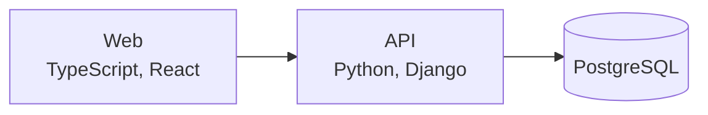

# qap

qap is a classroom quiz app where teachers write quizzes and run live sessions that students join with a room code. A React and TypeScript frontend calls a Django REST Framework API that stores users, quizzes, questions, sessions, and answers in PostgreSQL.

